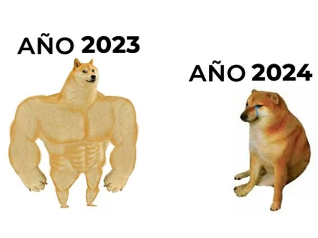

# Página web de ejemplo de la asignatura de Lenguajes de Marcas (M04UF1)

Esto formará parte de la documentación de la UF1. Revisar el código para entender mejor.

## Markdown

Markdown es un lenguaje de marcas pensado para documentación y para ser convertido a otros formatos.

### Cabeceras

Las cabeceras se marcan con tantas almohadillas como nivel de cabecera: # es h1; ## es h2; ... así hasta h6.

### Párrafos

Para hacer párrafos debe haber una o más líneas en blanco entre líneas.

Como por ejemplo, esta.

O esta otra... **recordatorio**: no pongáis espacios antes del primer carácter párrafo.

### Énfasis

#### Negrita

Para la negrita se utiliza dos asteriscos al **principio y al final** de la frase a destacar.

#### Cursiva

Para la cursiva se suele utilizar un guión bajo al _principio y al final_ de la frase a enfatizar.

**_Nota_**: No debe de haber espacio entre los asteriscos y/o el guión y la palabra a destacar.

#### Negrita y cursiva

Para utilizar dos énfasis lo haremos con dos asteriscos seguidos de un guión bajo y de la palabra o palabras a destacar.

### Listas

#### Ordenadas

1. Esto es un elemento
2. Esto es otro elemento, el segundo
3. Y un tercero

Las listas ordenadas necesitan un número y un punto seguido de un espacio y la palabra o palabras a añadir.

#### Sin orden

- Uno
- Dos
- Tres

Para las listas sin orden, un guión y un espacio.

#### Anidadas

Las listas anidadas son listas dentro de listas

1. Esto es el primer elemento
2. Esto es el segundo
	1. Esto es el elemento 2.1.
	2. Esto es el 2.2
3. Esto es el tercer elemento
	- Esto es una lista sin orden...
	- ...dentro de otra con orden

Para meter una lista dentro de otra, utilizamos la tabulación.

### Imágenes

Para añadir una imágen, hemos de dar una descripción y el nombre de la imagen (con la ruta, si hiciera falta).

La sintaxis es: exclamación seguido de una descripción dentro de llaves anguladas, seguido de el nombre de la imagen entre paréntesis (sin espacios entre exclamación, llaves anguladas y paréntesis).
